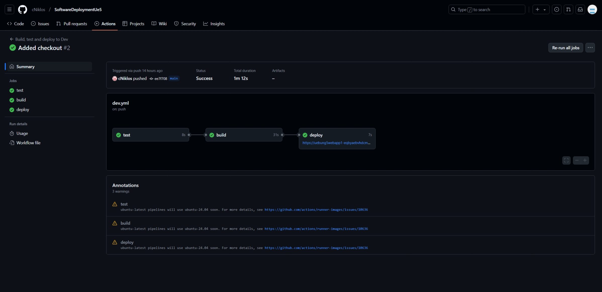
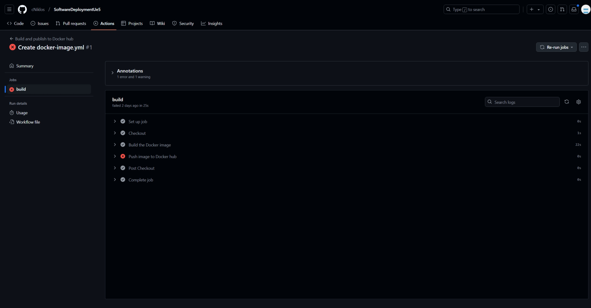
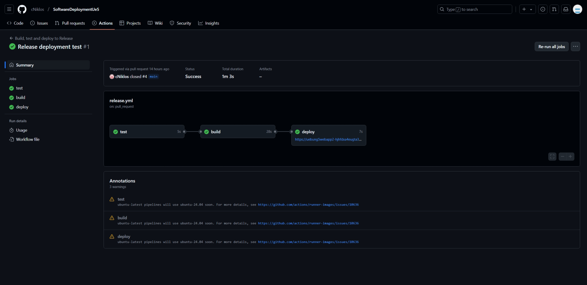

# SoftwareDeploymentUebung

## Team members

- Kikinger Lukas
- Kühmayer Ralf
- Mayerhofer Tristan
- Niklos Clemens

## Documentation

### Node.js Application
A node.js application with some sample code and a test is located in the root of the directory.

### Part 1
The first part is located in the `dev.yaml` file.
The github action is configured to start when a commit is pushed to the main branch. The file contains three jobs, which are `test`, `build` and `deploy`.  

The `test` job runs the tests and only if these are successful the `build` step is started. 

The `build` job logs in to the docker registry and pushes the container image there with the `dev` tag.

The `deploy` job deploys the app to the azure web app.

Here is a screenshot of a successful deployment:

Here is a screenshot of a failed deployment because the image could not be pushed to the docker hub as there was an incorrect link in the workflow:

### Part 2
The second part is located in the `release.yaml` file.  
The github action is configured to start when a pull request is closed. The file contains three jobs, which are `test`, `build` and `deploy`.  

The `test` job runs the tests and only if these are successful the `build` step is started. 

The `build` job logs in to the docker registry and pushes the container image there with the `latest` tag.

The `deploy` job deploys the app to the azure web app.

## Links

### Docker Image
https://hub.docker.com/r/clemensn/software-deployment-ue5

### Dev Azure Web App
https://uebung5webapp1-eqbyaebvhdcmh9ec.westeurope-01.azurewebsites.net/

### Release Azure Web App
https://uebung5webapp2-hjhfdxa4eugta3cz.westus-01.azurewebsites.net/
